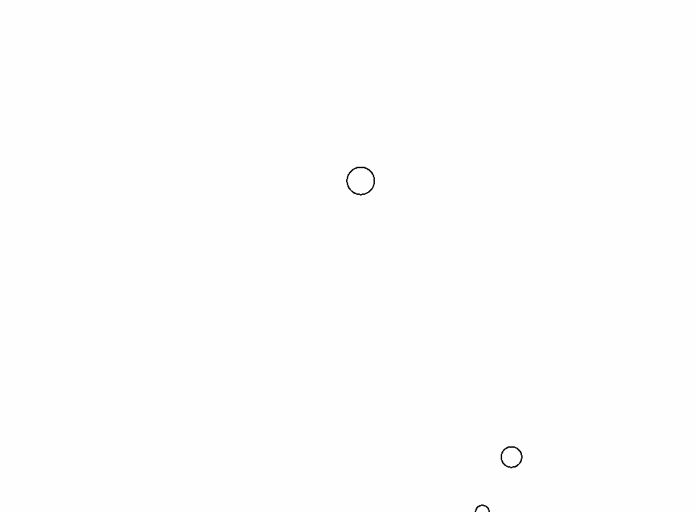

# Gravitaty Simulation
Three body gravitational simulation of massive stellar bodies in with custom vector physics using the law of universal gravitation

## Running locally
1. [Install Golang](https://golang.org/doc/install)
2. Clone this repository
3. Run `go run main.go`

## Example run using two objects of mass 1.0e12 kg and one object of mass 1.0e13 kg at 60x speed

## Acknowledgements
Thanks to the [Pixel](https://github.com/faiface/pixel) community for their hard work on creating an amazing-to-use 2d game engine in Golang!
